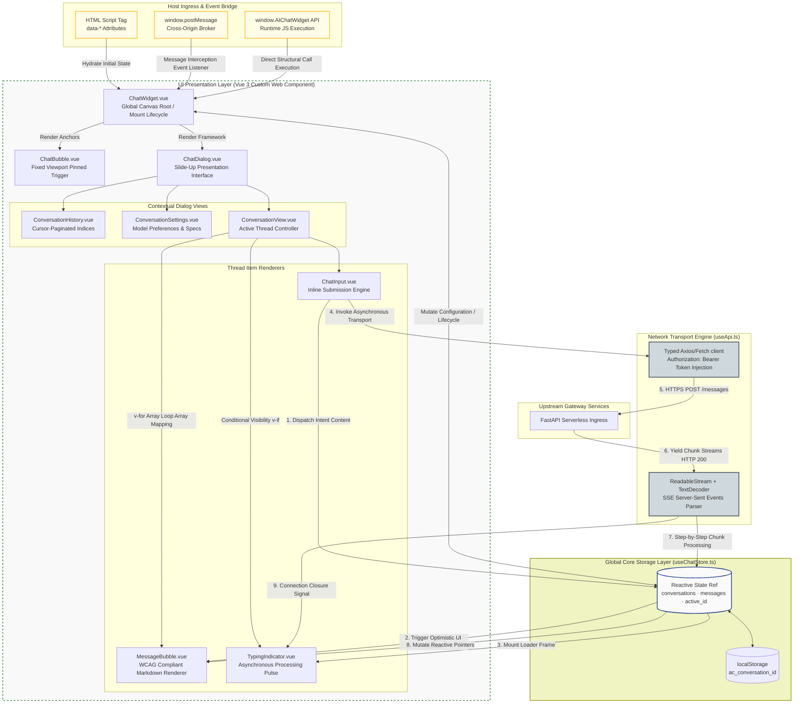

# Enterprise Embedable UI Chat Widget Architecture (Vue 3)

An enterprise-ready, production-grade, highly performant Vue 3 conversational widget. Explicitly engineered to operate natively as a standalone Single Page Application (SPA) development sandbox or compile into a zero-dependency, self-contained IIFE asset bundle for distributed `<script>` tag embedding across decoupled corporate properties.

## 🛠️ Core Engineering & Optimization Features

*   **Zero-Dependency IIFE Distribution:** Compiles down to an isolated, self-contained IIFE bundle, avoiding host-page namespace conflicts or library collisions.
*   **Cross-Frame Event Management:** Utilizes the HTML5 Web PostMessage API to safely update authorization matrices, dispatch instructions, and manage structural dialog states across cross-origin `iframe` layouts.
*   **WCAG 2.1 Level AA Accessibility Core:** Built with semantic ARIA markup patterns, keyboard trap management, and accessibility-first layouts optimized to pass rigid regulatory bank compliance audits.
*   **Sub-Second SSE Stream Parsing:** Leverages a lean, reactive `ReadableStream` composition layer to intercept, decode, and render Server-Sent Events (SSE) tokens instantly, with graceful fallback to non-streaming REST payloads.

---

## 🚀 Environment Initialization & Compilation

To stand up a localized virtual development environment and launch the interactive development sandbox:

```bash
npm install
cp .env.example .env          # Inject project-specific environmental variables
# Configure VITE_AGENT_API_ENDPOINT inside the .env layout
npm run dev
```

The server initializes local hosting on [http://localhost:5173](http://localhost:5173). The interactive chat bubble mounts pinned to the bottom-right viewport boundary.

## 📦 Distributed CDN Script-Tag Integration

Inject a single, compiled script element to mount the conversational interface inside any host property on `DOMContentLoaded`:

```html
<script
  src="https://enterprise.internal"
  data-api-endpoint="https://enterprise.internal"
  data-token="eyJhbGciOiJIUzI1NiJ9.eyJzdWIiOiJ1c2VyMSJ9..."
  data-welcome-message="Secure system initialized. How can I assist you with your portfolio?"
></script>
```

### Parameter Specification Matrix


| Mounting Attribute | Operational Requirement | System Integration Purpose |
|:---|:---|:---|
| `data-api-endpoint` | **Mandatory** | Absolute base URI hosting the upstream gateway API layers. |
| `data-token` | Optional | Cryptographically signed JWT bearer token supporting session authority. |
| `data-welcome-message` | Optional | Fallback empty-state system response string (Default: *Hello! How can I help you today?*). |

## 🔐 Cryptographic Token Injection Lifecycles

The architecture exposes three distinct pipelines to handle runtime OAuth2/JWT token rotation and execution lifecycles safely:

### 1. Static Initializer Attributes (Page Ingress)
```html
<script src="..." data-token="eyJ..."></script>
```

### 2. Runtime JavaScript API Hooks (Same-Origin State Propagation)
```js
window.AIChatWidget.setToken('new-jwt-token-string')
```

### 3. Cross-Frame PostMessage Broker (Cross-Origin Context Federation)
```js
window.postMessage({ type: 'AI_CHAT_SET_TOKEN', token: 'new-jwt-token-string' }, '*')
```

### Advanced Token Refresh Pattern (Pre-Expiry Interception)
To guarantee zero delivery disruption before token expiration limits are hit, integrate this asynchronous refresh wrapper within the host identity platform:

```js
async function refreshAndFederateToken() {
  const rotatedToken = await yourAuthClient.refreshToken()
  window.AIChatWidget.setToken(rotatedToken)
}
// Trigger refreshAndFederateToken() within standard authorization cron windows
```

## ⚙️ Core JavaScript Runtime Control API

Programmatically govern widget state transformations without relying on DOM elements:

```js
// Initialize configuration profiles programmatically
window.AIChatWidget.init({
  endpoint: 'https://enterprise.internal',
  token: 'eyJ...',
  welcomeMessage: 'Secure financial routing initialized.',
})

window.AIChatWidget.setToken('new-rotated-token')  // Rotate token context
window.AIChatWidget.open()                         // Trigger layout entry transitions
window.AIChatWidget.close()                        // Trigger layout exit transitions
window.AIChatWidget.sendMessage('Query active ledgers.') // Programmatically dispatch intent
```

## 📡 Cross-Origin PostMessage Event System

Dispatch actions safely from detached parent contexts or isolated child scripts:

```js
// Dispatch explicit conversational intent payload
window.postMessage({ type: 'AI_CHAT_SEND', message: 'Execute portfolio compliance search.' }, '*')

// Force identity token rotation across the active session
window.postMessage({ type: 'AI_CHAT_SET_TOKEN', token: 'eyJ...' }, '*')

// Programmatically scale open the presentation boundary
window.postMessage({ type: 'AI_CHAT_OPEN' }, '*')

// Programmatically collapse the presentation boundary
window.postMessage({ type: 'AI_CHAT_CLOSE' }, '*')
```

### PostMessage Event Schema Reference

| System Event Identifier | Required Data Structure Payload |
|:---|:---|
| `AI_CHAT_SEND` | `message: string` (The target query payload) |
| `AI_CHAT_SET_TOKEN` | `token: string` (The rotated cryptographic JWT) |
| `AI_CHAT_OPEN` | *None (State change only)* |
| `AI_CHAT_CLOSE` | *None (State change only)* |

## 🎨 Enterprise Theme Customization (CSS Tokens)

Override any core layout variables by redefining CSS custom properties at the `:root` pseudo-class level or target parent DOM boundaries:

```css
:root {
  --ac-primary: #1e3a8a;           /* Corporate Primary Branding Brand (Buttons / Interactive Anchors) */
  --ac-primary-hover: #1d4ed8;     /* Hover boundary states */
  --ac-user-bubble-bg: #1e3a8a;    /* User message card layout background fill */
  --ac-user-bubble-text: #ffffff;  /* High-contrast accessible typography text color */
  --ac-agent-bubble-bg: #f3f4f6;   /* System message card layout background fill */
  --ac-agent-bubble-text: #111827; /* Regulatory compliant scannable text color */
  --ac-dialog-bg: #ffffff;         /* Central frame canvas layout background fill */
  --ac-header-bg: #0f172a;         /* Conversational view header fill */
  --ac-header-text: #ffffff;       /* Header text accessible typography color */
  --ac-bubble-shadow: 0 4px 24px rgba(15, 23, 42, 0.12);
  --ac-font-family: inherit;
  --ac-border-radius: 12px;
}
```

## 🏗️ Production Compilation Pipelines

To compile raw single-file components into highly optimized production targets:

```bash
npm run build
```

The compiler isolates compilation profiles into two distinct output targets:


| Compilation Output | Asset Distribution Target |
|:---|:---|
| `dist/widget/ai-chat-widget.js` | Highly optimized, self-contained IIFE bundle explicitly bound for standard CDN hosting. |
| `dist/example/` | Complete, compiled static sandbox client application deployment target. |

To bypass sample app assembly and compile *only* the zero-dependency widget:
```bash
npm run build:widget
```

## 🧪 Test Automation Framework

To launch the unit and component regression testing suites:

```bash
npm test
```

*Note: Tests run via Jest leveraging `@vue/test-utils` processing. Component test blocks map to sequential files nested cleanly within `tests/components/` boundaries.*

## 🧩 Architectural Engineering Specifications

### State Layer Isolation (`useChatStore.ts`)
Decoupled module-level reactive states built on core Vue 3 refs, completely eliminating Pinia dependency bloat. Operates as a global singleton layout that maintains synchronization across separate tracking component nodes. Persists conversation pointers seamlessly across local client lifecycles (`ac_conversation_id` ➔ `localStorage`).

### API Streaming Protocols (`useApi.ts`)
Strongly typed ingestion layer routing outbound payloads. All transport methods seamlessly inject `Authorization: Bearer <token>` strings. Streaming flows utilize native `ReadableStream` primitives combined with a `TextDecoder` engine to intercept, split, and parse Server-Sent Events (SSE) `data:` lines in real-time.

### Reactive Composables Overview
*   `useApi.ts` — High-efficiency REST transport + SSE streaming consumer.
*   `useChatStore.ts` — Lightweight singleton reactive system data store.
*   `useConversation.ts` — Message ingestion execution, pagination logic, and conversational state tracking.
*   `useConversations.ts` — Cursor-paginated history indices loading view states.
*   `useModels.ts` — Ingests authorized model access schemas into system preferences panel trackers.

### Real-Time Streaming Sequence Map
1. User Message Ingress  ➔ Optmistic UI Update Applied to State Registry
2. Ingress Completed     ➔ TypingIndicator Layer Mounts to Block UI Input Delay
3. First Byte Received    ➔ TypingIndicator Smoothly Swaps with Live Streaming Token Nodes
4. Pipeline Closes       ➔ Complete MessageResponse Entity Committed into Persistent Message Array
5. Network Interception  ➔ Smooth Automatic Fallback to Standard REST POST Layer if Stream Drops

### UI Component Hierarchy Tree

```
ChatWidget (Global Canvas Root)
├── ChatBubble          (Viewport fixed action component)
└── ChatDialog          (Slide-up presentation interface container)
  ├── ConversationView
  │   ├── MessageBubble (Multi-tenant text/markdown component array)
  │   ├── TypingIndicator
  │   └── [ChatInput — Contextual inline submission engine]
  ├── ConversationHistory
  └── ConversationSettings
```

## Frontend Component Topology & Reactive Data Flow

The architecture decouples the structural layout layer (Vue VNodes) from the persistent transport engine (`useApi`) and the global reactive data layer (`useChatStore`), ensuring strict unidirectional data flow and non-blocking stream parsing.


